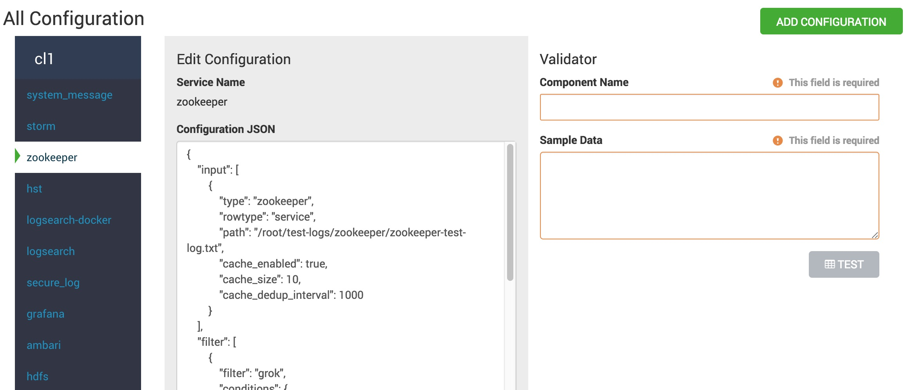
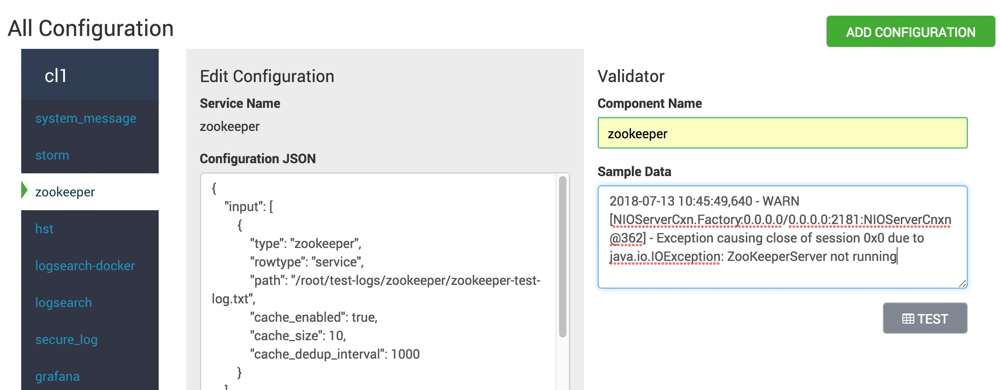
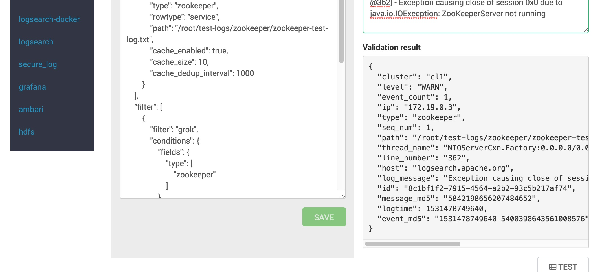

<!---
Licensed to the Apache Software Foundation (ASF) under one or more
contributor license agreements. See the NOTICE file distributed with
this work for additional information regarding copyright ownership.
The ASF licenses this file to You under the Apache License, Version 2.0
(the "License"); you may not use this file except in compliance with
the License. You may obtain a copy of the License at

http://www.apache.org/licenses/LICENSE-2.0

Unless required by applicable law or agreed to in writing, software
distributed under the License is distributed on an "AS IS" BASIS,
WITHOUT WARRANTIES OR CONDITIONS OF ANY KIND, either express or implied.
See the License for the specific language governing permissions and
limitations under the License.
-->

## Adding New Logs to Monitor

#### Input / Filter (shipper) descriptors

For adding a new log that will be monitored by Log Feeder, first, it is needed to understand how Log Feeder registers and use those logs as inputs.
All the input log descriptors are stored in Log Feeder configuration directory with `input.config-<service>.json` naming pattern. (see: [Shipper configurations](shipper_configurations.md))

Based on these descriptors, the Log Feeder will start to monitor the inputs that are defined inside the descriptor as inputs. 
After the configs are first processed, those will be handled/uploaded by a configuration handler, that should be an implementation of the Config API.

#### Config API

The Config API is responsible for to load and handle input (and filter) descriptors for Log Feeder. The idea is to store those configurations in a shared system 
and Log Feeders should be notified about any of the input configuration changes. 
It has different implementations, the default one is ZooKeeper (there is 2 other one right now: Solr and Local as well). Also with using/enabling the Config API, 
the user will be able to edit / test / add input descriptors.

#### Support new input descriptor(s) for Ambari components

- Create a new jinja template: `<SERVICE_LOCATION>/package/templates/input.config-<service_name>.json.j2`

```jinja2
{
  "input":[
    {
      "type":"my_log",
      "rowtype":"service",
      "path":"{{default('/configurations/myservice-env/log_dir', '/var/log/myservice')}}/my_log*.log"
    },
    {
      "type":"myother_log",
      "rowtype":"service",
      "path":"{{default('/configurations/myservice-env/log_dir', '/var/log/myservice')}}/myother_log*.log"
    }
  ],
  "filter": [
    ...
  ]
```

- Change the stack code to write the input descriptor (add this to the start script):

```python
from resource_management.core.source import Template
from resource_management.libraries.functions.default import default
from resource_management.libraries.functions.generate_logfeeder_input_config import generate_logfeeder_input_config

# ...
    # that will write input.config.myservice.json file to /usr/lib/ambari-logsearch-logfeeder/conf folder
    generate_logfeeder_input_config('myservice', Template("input.config-myservice.json.j2", extra_imports=[default]))
# ...
```
- Edit the `metainfo.xml`: add logId mapping for components (logIds are log types in input descriptors)
```xml
<!--  ... -->
     <components>
        <component>
          <name>MYCOMPONENT</name>
          <logs>
            <log>
              <logId>my_log</logId>
              <primary>true</primary>
            </log>
            <log>
              <logId>myother_log</logId>
            </log>
          </logs>
          <!--  ... -->
        <component>
     <components>
     <!--  ... -->
```
From that point - during service start - the input config desriptor will be written into `/usr/lib/ambari-logsearch-logfeeder/conf`. The Log Feeder applications monitor the files in that folder, if there is a new one, it will start to monitor those inputs. Note that if the Config API is configured to use ZooKeeper, these configurations are only used from bootstrapping, after these files are uploaded to ZooKeeper, you will be onlyable to edit the input descriptos by Log Search Portal (or manually edit the znodes)

#### Add / Edit / Test input desriptors by Log Search Portal

On the Log Search Portal (if you go into `Configuration Editor`) you can edit (or add) existing input / filter configurations:



Also you can add test samples that you can validate:



If the validation is successful, you should got a map response with the created fields:



### Add input descriptors without Ambari

As you need the `input.config-<service>.json` files in `/usr/lib/ambari-logsearch-logfeeder/conf` folder (or where your configuration is located), it is enough to just create a new file at that location.