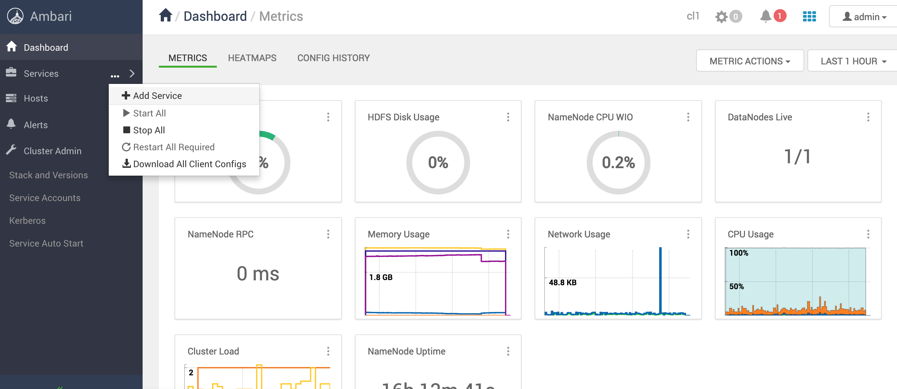
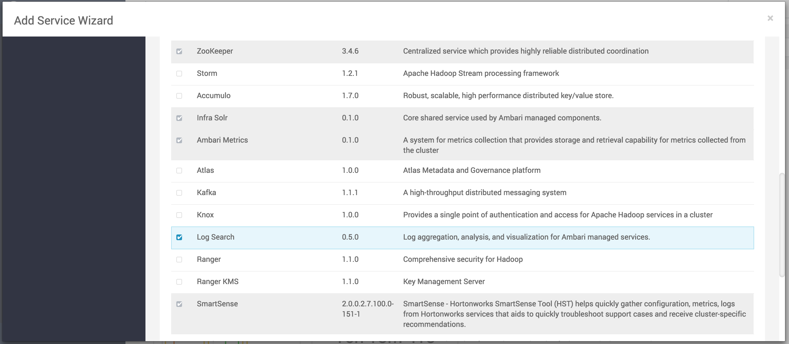

<!---
Licensed to the Apache Software Foundation (ASF) under one or more
contributor license agreements. See the NOTICE file distributed with
this work for additional information regarding copyright ownership.
The ASF licenses this file to You under the Apache License, Version 2.0
(the "License"); you may not use this file except in compliance with
the License. You may obtain a copy of the License at

http://www.apache.org/licenses/LICENSE-2.0

Unless required by applicable law or agreed to in writing, software
distributed under the License is distributed on an "AS IS" BASIS,
WITHOUT WARRANTIES OR CONDITIONS OF ANY KIND, either express or implied.
See the License for the specific language governing permissions and
limitations under the License.
-->

## Installation

#### Requirements for building the project

- Java 8+
- Maven 3.5.x +
- `rpm-build` on Mac OS X

#### Checkout the project

```bash
git clone https://github.com/apache/ambari-logsearch
cd ambari-logsearch
```
#### Build Log Search packages 

- a.) Create RPM packages (outputs: ambari-logsearch-assembly/target/rpms/*)
```bash
make rpm
```

- b.) Create DEB packages (outputs: ambari-logsearch-assembly/target/*.deb)
```bash
make deb
```

- c.) Create tarballs (outputs: ambari-logsearch-server/target/ambari-logsearch-portal.tar.gz and ambari-logsearch-logfeeder/target/ambari-logsearch-logfeeder.tar.gz)
```bash
make package
```

#### Install created packages 

- On RHEL / CentOS :
```bash
# Log Search Portal (server + UI)
yum install -y /my/path/ambari-logsearch-portal.rpm
# Log Feeder
yum install -y /my/path/ambari-logsearch-logfeeder.rpm
# or if a repo is available that contains logsearch packages
yum install -y ambari-logsearch-portal
yum install -y ambari-logsearch-logfeeder
```
- On Debian / Ubuntu :
```bash
# Log Search Portal (server + UI)
dpkg -i /my/path/ambari-logsearch-portal.deb
# Log Feeder
dpkg -i /my/path/ambari-logsearch-logfeeder.deb
# or if a repo is available that contains logsearch packages
apt-get install ambari-logsearch-portal
apt-get install ambari-logsearch-logfeeder
```
- With tarball :
```bash
mkdir logsearch
tar -xzf ambari-logsearch-portal.tar.gz -C logsearch

mkdir logfeeder
tar -xzf ambari-logsearch-logfeeder.tar.gz -C logfeeder
```

#### Install by Ambari UI

Click on Add Service page:



Then select Log Search on Add Services page:



Then (after setting the right configuration on Configure services page) you can start the Log Search / Log Feeder deployments.

#### Component names to use in Ambari Blueprints:

- Log Search Portal: `LOGSEARCH_SERVER` (1 node, or 1+, as Log Search Portal is stateless)
- Log Feeder: `LOGSEARCH_LOGFEEDER`(All nodes)

#### Requirements for using Log Search

- `Solr` 6.x+ and `ZooKeeper` (as Solr is used in Cloud mode) is required for Log Search Portal - Ambari Infra Solr can be used as a built-in Solr service in Ambari, but of course it can use an external Solr as well.
- Log Feeder in Cloud mode can work without Solr and ZooKeeper (that means logs will be shipped to HDFS/S3/GCS/WASB/ADLSv2 ... but Log Search Portal won't be able to display data from those Storages)

#### Configurations

##### Log Search Portal configuration:

Required configuration files for Log Search Portal at `/usr/lib/ambari-logsearch-portal/conf`:

- logsearch.properties
- logsearch-env.sh
- log4j2.yml
- info.properties
- default.properties

##### Log Feeder configuration:

Required configuration files for Log Feeder at `/usr/lib/ambari-logsearch-logfeeder/conf`:

- logfeeder.properties
- logfeeder-env.sh
- log4j2.yml
- alias_config.json
- global.config.json
- output.config.json
- input.config-<service_name>.json (use this filename pattern for input configurations)
- checkponts/*.cp (checkpoint files - information about monitored input files)


See more about the configurations: [Log Search properties](logsearch_properties.md), [Log Feeder properties](logfeeder_properties.md) and [Log Feeder shipper configurations](shipper_configurations.md) 

#### Starting Log Search / Log Feeders

Go to Ambari UI and start Log Search components or manually starts by `logsearch.sh` or `logfeeder.sh` script
```bash
# starting Log Search
/usr/lib/ambari-logsearch-portal/bin/logsearch.sh start
# starting Log Feeder
/usr/lib/ambari-logsearch-logfeeder/bin/logsearch.sh start
```